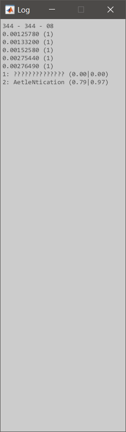

# Interferers DoS Attacks
A small but comprehensive MATLAB framework to simulate the DoS attacks caused by interferers on a moving target. In this repository, I provide a simple framework for the implementation of DoS attacks and beamforming-based solutions. In addition, I also create a simple framework for creating modern GUIs in MATLAB that support user-friendly interactions and graphical transitions capabilites.

## Backend
As explained by <a href="https://en.wikipedia.org/wiki/Denial-of-service_attack">Wikipedia</a>, a Denial-of-Service attack (DoS attack) is a cyber-attack in which interferers make a network resource unavailable to its intended users by disrupting services provided by it. The idea behind the implementation of this framework is simple. We have a receiver surrounded by a number of interferes and scatters. In order to mitigate the interference caused by the interferes, the transmitter uses beamforming to lock on the receiver. It also uses the scatters to relay the signals and increase QoS. For more information, you can refer to the references mentioned at the end.

## GUI Development
For the GUI, I use the built-in functionalities of MATLAB including figure creations and callback definitions. However, to implement a graphical transition effect, I created asynchronous timers that receive animation commands and deliver the result after specified duration. Please note that the command becomes effective after the end of its respective transition.

# Execution
To start the simulation, simply run the [GUI.m](GUI.m). With the help the implemented GUI, a figure will be generated. As shown in the left figure below, you can decided to see hints during the simulation. After that, you can click on `Start` to continue. Then, as depicted in the right figure below, you can define simulation parameters, which are set to their default values. By clicking on `Initiate the System`, you can enter the simulation system. 

	&#9;

After that, assuming you have chosen to get hints, you need to follow the instructions as shown in the left figure below. Finally, considering the middle figure below, you can start the simulation if you hit `Start the Simulation`. After this command, as illustrated by the right figure, a new figure will be created that allows you to access the logs during the simulation.

	&#9;&#9;

During the simulation, you are allowed to pause and make some modifications. The following figures describe how the process is done. 

	&#9;

# References
1. Rappaport, T. S., 1995. Wireless Communications: Principles and Practice. Prentice Hall, pp.69-70&139-141.
2. Goldsmith, A., 2005. Wireless Communications. Cambridge University Press, pp.24-49&58-85.
3. Mailloux, R. J., 2006. A History of Phased Array Antennas. In: Sarkar, T.K., Mailloux, R., Oliner, A.A., Salazar-Palma, M. and Sengupta, D.L., 2006. History of wireless. Wiley, pp.567-573.
4. Mailloux, R. J., 2017. Phased Array Antenna Handbook. 2nd Ed. Artech Print, pp.1-57&63-106.
5. Grover, K., Lim, A. and Yang, Q., 2014. Jamming and anti-jamming techniques in wireless networks. International Journal of Ad Hoc and Ubiquitous Computing, 17(4), pp.197-215.
6. Li, Y., Vorobyov, S.A. and Hassanien, A., 2014, May. Robust beamforming for jammers suppression in MIMO radar. In: Radar Conference, 2014 IEEE, pp.0629-0634. IEEE.
7. Wood, A.D. and Stankovic, J.A., 2002. Denial of service in sensor networks. Computer, 35(10), pp.54-62.
8. Marzetta, T.L., 2010. Noncooperative cellular wireless with unlimited numbers of base station antennas. IEEE Transactions on Wireless Communications, 9(11), pp.3590-3600.
9. Khan, S.A. and Malik, S.A., 2011. Adaptive beamforming algorithms for anti-jamming. International Journal of Signal Processing, Image Processing and Pattern Recognition, 4(1), pp.95-106.
10. Shengkui, Z., Zhihong, M. and Suiyang, K., 2007. A fast variable step-size LMS algorithm with system identification. In: ICIEA (IEEE Conference on Industrial Electronics and Applications). Harbin, China, 23-25 May 2007. IEEE: pp.2340-2345.
11. Krishnaveni, V., Kesavamurthy, T. and Aparna, B., 2013. Beamforming for direction-of-arrival (DOA) estimation - a survey. International Journal of Computer Applications, 61(11).